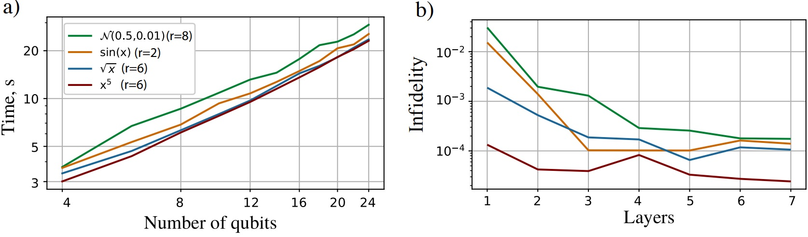

# QPrep
A library devoted to quantum state preparation via tensor netwokrs. As an input it takes a function and number of qubits and returns a qiskit circuit for preparing the quantum state.



## Requirements
TensorFlow >= 2.0 
- qiskit (https://github.com/Qiskit/qiskit)
- ttpy (https://github.com/oseledets/ttpy) 
- QGOpt (https://github.com/LuchnikovI/QGOpt)
- Cotengra (https://github.com/jcmgray/cotengra)
- TensorNetwork (https://github.com/google/TensorNetwork)

Use 
```
   !pip install -r requirements.txt
```


## Installation
Clone the repository:

```
   git clone git://github.com/AlenaAT/QPrep
```

Pip installation:

```
   !pip install git://github.com/AlenaAT/QPrep
```


## Example
An example of using our method is available right now in example.ipynb

## Related publications
Coming soon
## Authors
This package is made by [Termanova A.A.](https://github.com/AlenaAT), [Melnikov Ar.A.](https://github.com/Arty1498) and [Perelshtein M.R.](https://github.com/mperelshtein)
